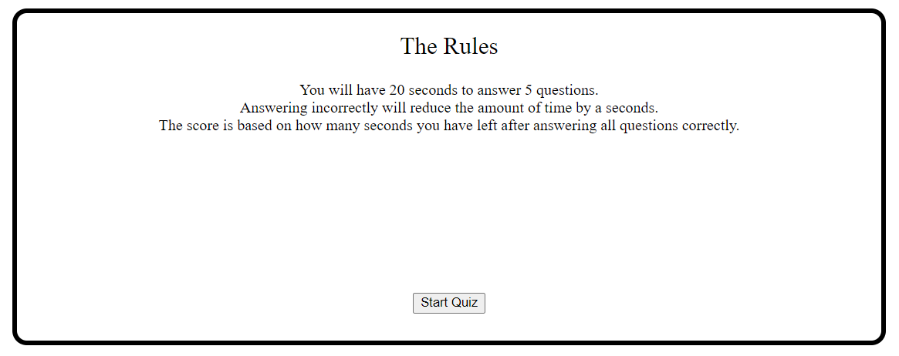
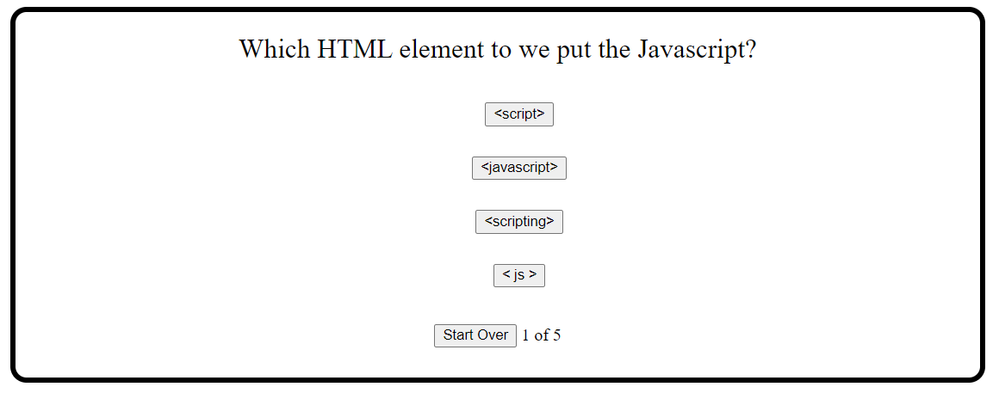
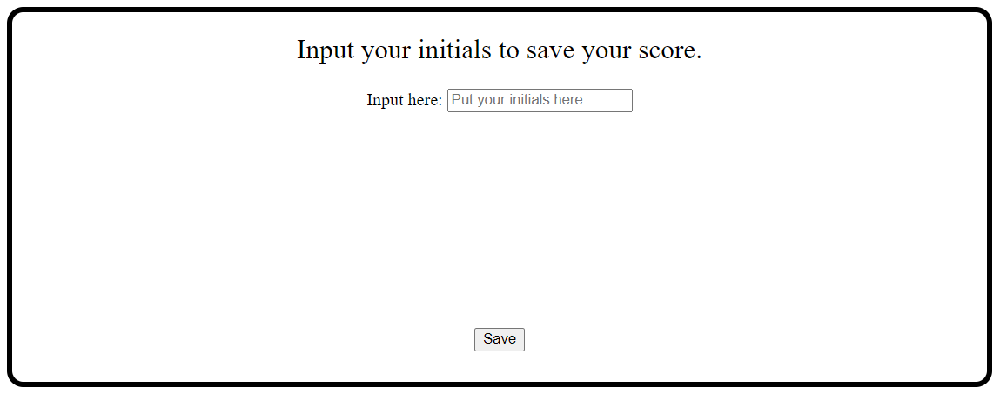
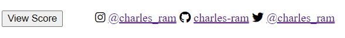

# Timed Quiz Application

## Description

This project is a timed quiz that uses web API's to time you taking a quiz and to also save your score. The project consists of an index file for content, css styling to style the different "cards" and a javascript file to interact with the page, time the quiz, and to store the score in local storage.

## Installation

To install this application download the file in the Github.

## Prerequisities

In order to isntall this application and edit the code you must have a text editor installed. The one I used for this project was Studio Visual Code.

## Usage

Click the "Start Quiz" button to begin the timed quiz. Click the "View Score" button to view previous scores. Correctly answer the questions to progress or click the "Start Over" button to return to the main page. Once the quiz is completed, enter your initials and click the "Save" to save your score into the local storage of your browser.

Start Quiz Button/ Main Page

Start Over Button

Save Button

View Score Button

## Links
[GitHub](https://github.com/charles-ram/m4-timed-quiz)
[Launched-Site](https://charles-ram.github.io/m4-timed-quiz/)